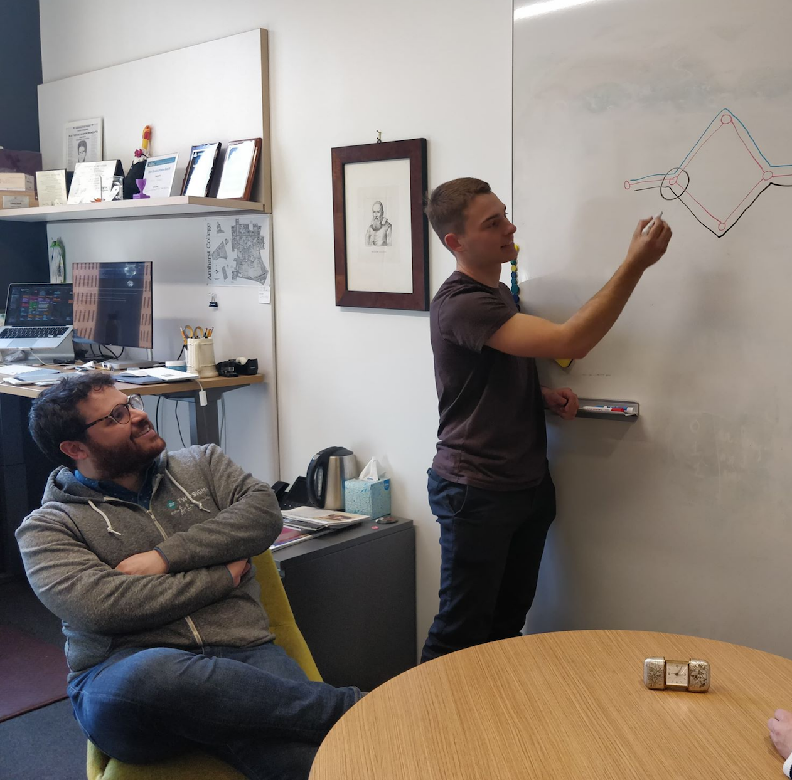
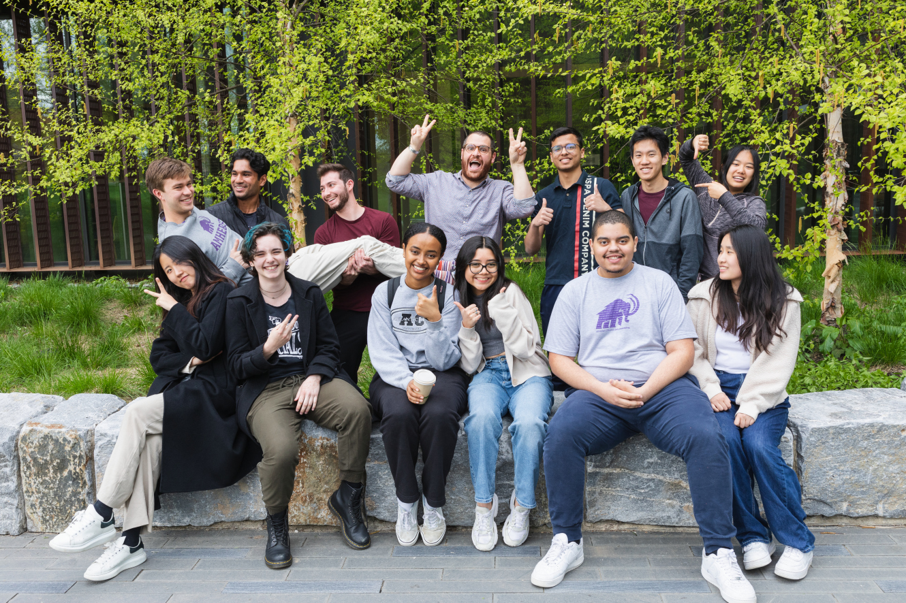
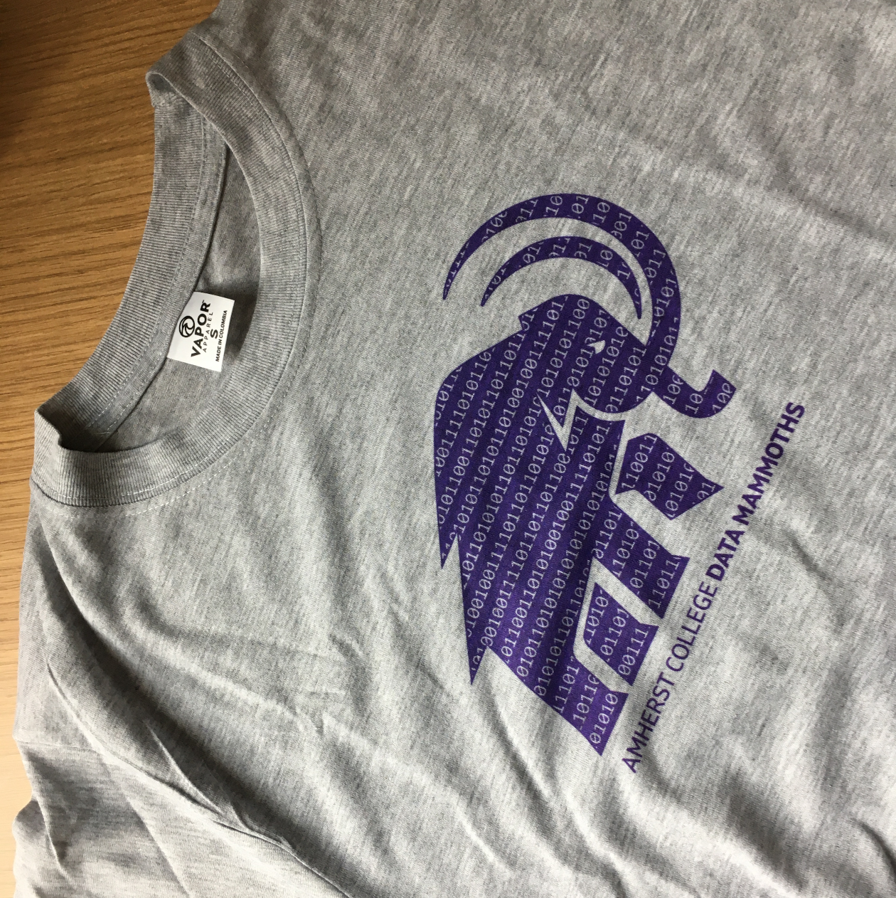

## Amherst College Data* Mammoths

### [News](#news)    [Publications](#pubs)    [Members](#members)    [How to join?](#join)

We are a **research and learning** group led by [Prof. Matteo
Riondato](http://matteo.rionda.to) at [Amherst College](https://www.amherst.edu),
mostly in the [Computer Science](https://cs.amherst.edu) department.

We create and learn about algorithms for *"everything data"*:[^1] data mining,
network science, machine learning, data science, knowledge discovery, databases,
and much more. You can read more about what we do in the [Q&A with
Matteo](https://www.amherst.edu/news/news_releases/2020/9-2020/computer-science-for-science)
for the college website.

The methods we develop often leverage randomness (e.g., sampling, statistical
hypothesis testing, sketches) and offer strong guarantees on their performance.

Our research is sponsored, in part, by the National Science Foundation under
[award #2006765](https://www.nsf.gov/awardsearch/showAward?AWD_ID=2006765).

When we are not working together at the whiteboard, writing code, or reading
papers, you can find us in courses such as [COSC-254 Data
Mining](https://www.amherst.edu/academiclife/departments/courses/2021S/COSC/COSC-254-2021S),
[COSC-257
Databases](https://www.amherst.edu/academiclife/departments/courses/1920F/COSC/COSC-257-1920F),
[COSC-351 Information Theory](https://www.amherst.edu/academiclife/departments/courses/2223S/COSC/COSC-351-2223S),
[COSC-355 Network
Science](https://www.amherst.edu/academiclife/departments/courses/2223F/COSC/COSC-355-2223F),
or taking an independent study course (COSC-490) with Matteo.

[//]: # "Comment: the footnote below must be all in a single line"

 [^1]: That's the reason for the `*` in `Data*`, as `X*` means "everything X", in computer science jargon.

##  News

* Maryam and Alex published [ROhAN](https://github.com/acdmammoths/ROhAN-code/raw/main/AbuissaEtAl-ROhAN-DMKD23.pdf) in
    [DAMI/DMKD](https://link.springer.com/journal/10618).

* Stefan was selected as a finalist for the [2023 CRA Outstanding Undergraduate
    Researcher
    Award](https://cra.org/about/awards/outstanding-undergraduate-researcher-award/).

* The [journal version of
    Bavarian](https://github.com/acdmammoths/Bavarian-code/raw/main/CousinsEtAl-Bavarian-TKDD23.pdf),
    coauthored by Chloe, was published in [ACM TKDD](https://tkdd.acm.org).

##  Publications with Mammoths student authors
Mammoths student/alumni authors in *italics*.

* *Maryam Abuissa*, *Alexander Lee*, and Matteo Riondato. [*ROhAN: Row order
    agnostic null models for statistically-sound knowledge
    discovery*](https://github.com/acdmammoths/ROhAN-code/blob/main/AbuissaEtAl-ROhAN-DMKD23.pdf).
    Data Mining and Knowledge Discovery ([S.I. for ECML
    PKDD'23](https://link.springer.com/journal/10618/topicalCollection/AC_405d0ca97322bed6d7bb7cf14504b211/page/1)).
    [GitHub repo](https://github.com/acdmammoths/ROhAN-code)

* Cyrus Cousins, *Chloe Wohlgemuth*, and Matteo Riondato. [*Bavarian: Betweenness
    Centrality Approximation with Variance-Aware Rademacher
    Averages*](https://github.com/acdmammoths/Bavarian-code/raw/main/CousinsEtAl-Bavarian-TKDD23.pdf).
    ACM Trans. on Knowledge Discovery from Data, 17(6):78, 2023. [GitHub
    repo](https://github.com/acdmammoths/Bavarian-code)

* *Steedman Jenkins*, *Stefan Walzer-Goldfeld*, and Matteo Riondato. [*SPEck:
    Mining Statistically-significant Sequential Patterns Efficiently with Exact
    Sampling*](https://github.com/acdmammoths/SPEck-code/raw/main/JenkinsEtAl-SPEck-DMKD22.pdf),
    Data Mining and Knowledge Discovery, 36(4):1575–1599, 2022 (S.I. for ECML
    PKDD'22). [GitHub repo](https://github.com/acdmammoths/SPEck-code)

* *Alexander Lee*, *Stefan Walzer-Goldfeld*, *Shukry Zablah*, and Matteo
    Riondato. [*A Scalable Parallel Algorithm for Balanced
    Sampling*](https://github.com/acdmammoths/parallelcubesampling/raw/main/paper/cubesampling.pdf).
    AAAI'22 (student abstract). [GitHub
    repo](https://github.com/acdmammoths/parallelcubesampling)

* Cyrus Cousins, *Chloe Wohlgemuth*, and Matteo Riondato. [*Bavarian: Betweenness
    Centrality Approximation with Variance-Aware Rademacher
    Averages*](/pubs/CousinsEtAl-BavarianBetweennessCentralityApproximationWithVarianceAwareRademacherAverages-KDD21.pdf).
    ACM KDD'21.

##  Members

* (Prof.) [Matteo](http://matteo.rionda.to) (Riondato),
    [mahout](https://en.wikipedia.org/wiki/Mahout) of the herd.

[//]: # "Comment: alphabetical by last name"

* Maryam Abuissa'24 (Spring'22--), algorithms for statistically-sound knowledge
    discovery.

* Michelle Contreras Catalan'25 (Fall'22--), algorithms for statistically-sound
    knowledge discovery.

* Daniel Flores-Garcia'24 (Spring'23--), algorithms for statistically-sound
    knowledge discovery.

* Wanting (Sherry) Jiang'25 (Spring'23--), database design for educational
    surveys.

* Hailin (Angelica) Kim'24 (Spring'23--), algorithms for statistically-sound
    knowledge discovery.

* Sarah Park'23 (Summer'22--), honors thesis on higher-power methods for
    statistically-significant patterns.

* Stefan Walzer-Goldfeld'23 (Fall'20--), honors thesis on null models for rich
    data, null models for sequence datasets, scalable algorithms for cube
    sampling.

### Alumni

[//]: # "Comment: Most recent first, then alphabetical by last name"

* Dhyey Mavani'25 (Fall'22), efficient implementations of algorithms for
    significant pattern mining.

* Steedman Jenkins'23 (Spring'21--Fall'22), mining statistically-significant
    patterns.

* Shengdi Lin'23E (Spring'22--Fall'22), honors thesis on rapidly-converging MCMC
    methods for statistically-significant patterns. Honors thesis (cum Laude).

* Adam Gibbs'22 (Fall'21--Spring'22), parallel/distributed subgraph matching
    with security applications.

* [Alexander Lee](https://www.alexanderwlee.com)'22 (Fall'20--Spring'22),
    scalable algorithms for cube sampling, statistical evaluation of data mining
    results. Honors thesis (Summa cum Laude), 2022 Computer Science Prize.

* Vaibhav Shah'23 (Fall'21), teaching materials for the COSC-254 Data Mining
    course.

* Maryam Abuissa'24 (Summer'21), teaching materials for the COSC-111
    Introduction to Computer Science 1 course.

* Holden Lee'22 (Spring'20--Spring'21), sampling-based algorithms for frequent
    subgraph mining.

* [Isaac Caruso](https://icaruso21.github.io/)'21 (Fall'20--Spring'21), honors
    thesis on *"Modeling Biological Species Presence with Gaussian Processes"*,
    cum laude.

* Conrad Kuklinsky'21 (Spring'19--Fall'20), VC-dimension for intersections of
    half-spaces.

* Margaret Drew'22 (Summer'20), assignments and videos for the COSC-111
    Introduction to Computer Science 1 course.

* Kathleen Isenegger'20 (Fall'19--Spring'20), honors thesis on *"Approximate
    Mining of High-Utility Itemsets through Sampling"*, magna cum laude.

* Chloe Wohlgemuth'22 (Fall'20--Spring'22), sampling-based algorithms for
    centrality approximations in graphs.

* [Shukry Zablah'20](https://www.shukryzablah.com) (Fall'19--Spring'20), honors
    thesis on *"A Parallel Algorithm for Balanced Sampling"*, magna cum laude,
    2020 Computer Science Prize.

##  How to join

If you are an Amherst student, and are interested in mixing data, computer
science, probability, and statistics, please contact Matteo. With rare
exceptions, you should have taken or be enrolled in COSC-211 Data Structures.
Having taken one or more courses in probability and/or statistics (e.g.,
STAT-135, COSC-223, MATH/STAT-360) is a plus, but not necessary, although if you
haven't, it is likely that you will get to spend a semester learning about
probability in computer science, possibly in an independent study course with
Matteo.

## 🐘 💜 💾  We love data!

[//]: # "Comment: :elephant: :purple_heart: :floppy_disk:"
